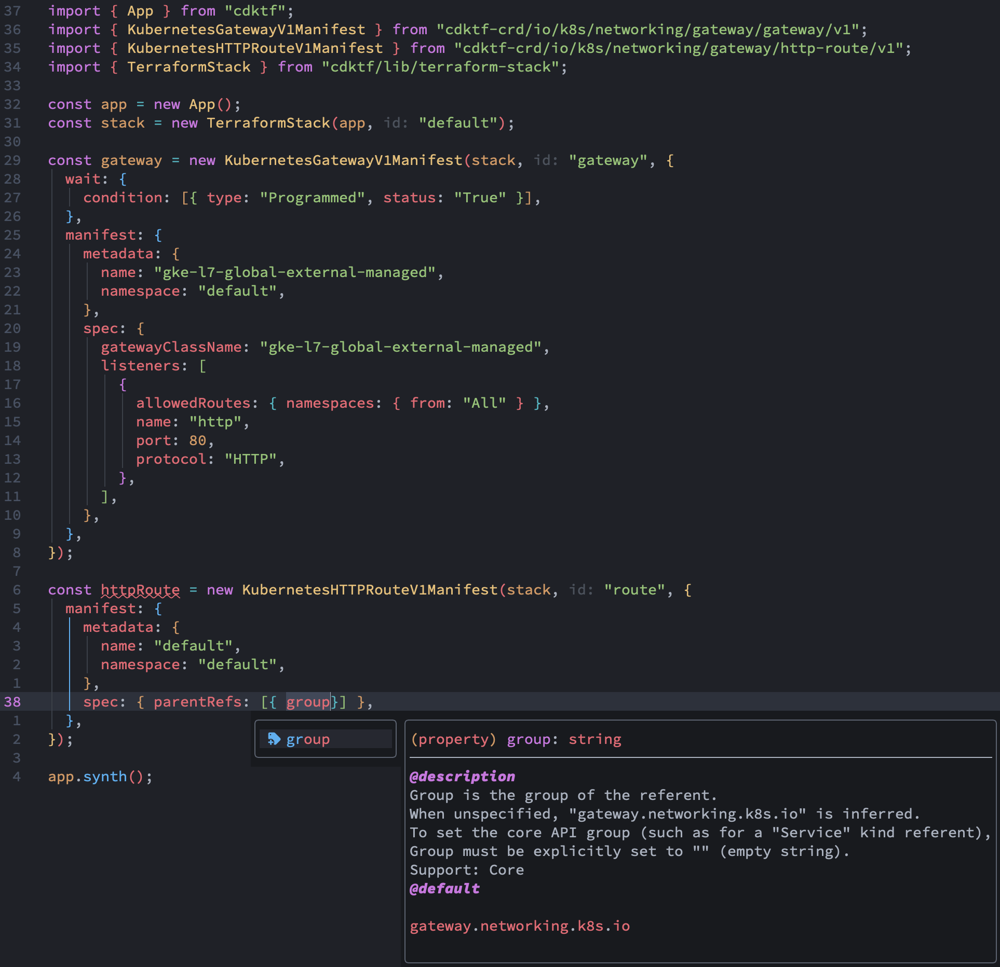

[](https://badge.fury.io/js/cdktf-crd)

# Typescript Definitions for CDK for Terraform

cdktf-crd is a library including generated typescript definitions for common custom resource definitions.

cdktf-typescript-crd includes two packages:

- [crd](./crd) - Output directory and the package root for [cdktf-crd](https://www.npmjs.com/package/cdktf-crd) npm package.
- [generator](./generator) - CLI app that scrapes custom resource definitions from clusters in the kube config.

## Get Started

- Install the `cdktf-crd` package.
  `npm install cdktf-crd`

- Use a manifest
  

## Contributing

- Clone the project repository.

  ```bash
  git clone git@github.com/glacion/cdktf-typescript-crd.git
  ```

- Download dependencies.

  ```bash
  cd cdktf-typescript-crd
  npm install
  ```

- Generate and build the packages.

  ```bash
  npm run build
  ```
